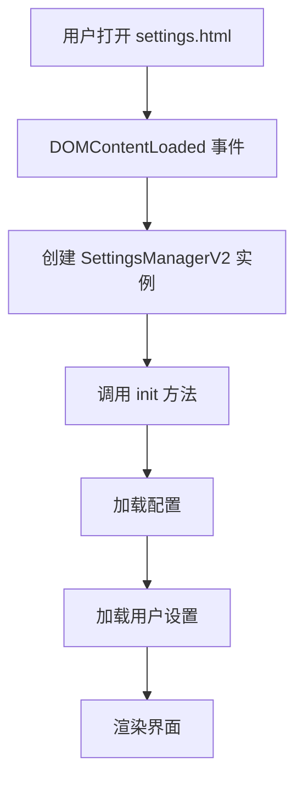
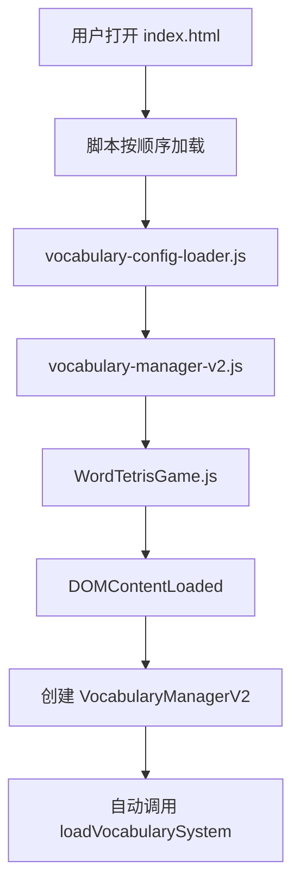

# Word Tetris 单词加载逻辑文档

> 版本: 2.0  
> 更新时间: 2025-10-10  
> 作者: AI Assistant

## 📋 目录

- [核心架构概述](#核心架构概述)
- [一、设置页面加载逻辑](#一设置页面加载逻辑)
- [二、游戏页面加载逻辑](#二游戏页面加载逻辑)
- [三、完整数据流向图](#三完整数据流向图)
- [四、关键数据结构](#四关键数据结构)
- [五、性能优化要点](#五性能优化要点)
- [六、配置同步机制](#六配置同步机制)
- [七、总结](#七总结)

---

## 🎯 核心架构概述

Word Tetris 的单词加载系统采用**两层架构**设计：

### 架构层次

1. **配置层**（`VocabularyConfigLoader`）
   - 负责发现和管理词库元数据
   - 扫描文件系统，构建词库配置
   - 提供词库信息查询接口

2. **数据层**（`VocabularyManagerV2`）
   - 负责加载和管理单词数据
   - 延迟加载优化性能
   - 全局去重，构建单词池

### 涉及的核心文件

| 文件 | 职责 | 说明 |
|------|------|------|
| `vocabulary-config-loader.js` | 配置加载器 | 扫描词库目录，构建配置对象 |
| `vocabulary-manager-v2.js` | 单词管理器 | 加载单词数据，管理单词池 |
| `settings.js` | 设置页面管理 | 用户界面交互，保存配置 |
| `WordTetrisGame.js` | 游戏主逻辑 | 获取单词，游戏流程控制 |

---

## 🔵 一、设置页面加载逻辑

### 页面文件
- **HTML**: `proj/settings.html`
- **JavaScript**: `proj/src/ui/settings.js`

### 1.1 页面初始化流程



### 1.2 配置加载详细流程

#### 步骤 1: 加载词库配置

```javascript
async init() {
    // 1. 加载配置文件
    await this.loadConfig()
}

async loadConfig() {
    const configLoader = new VocabularyConfigLoader();
    this.config = await configLoader.loadConfig();
}
```

**配置加载器工作流程**：

```
VocabularyConfigLoader.loadConfig()
    ↓
并行扫描三个目录：
    ├─ scanDailyPhonics()    // ./words/daily-phonics/*.json
    ├─ scanSpecialPractice() // ./words/special-practice/*.json
    └─ scanGradeBased()      // ./words/grade-based/**/*.json
    ↓
构建配置对象：
    {
        metadata: { version, description, ... },
        categories: [
            {
                id: "daily-phonics",
                name: "按天学习音标",
                subcategories: [
                    {
                        id: "day01",
                        name: "Day 1",
                        filename: "daily-phonics/day01.json",
                        phoneme: "/iː/",
                        wordCount: 15,
                        difficulty: "beginner"
                    },
                    // ...
                ]
            },
            // special-practice
            // grade-based
        ],
        defaultConfig: {
            enabledLibraries: ["day01", "day02", ...],
            maxWords: 200,
            difficultyRange: [1, 3]
        }
    }
```

#### 步骤 2: 加载用户设置

```javascript
loadUserSettings() {
    const saved = localStorage.getItem('wordTetris_selectedLibraries');
    
    if (saved) {
        const parsed = JSON.parse(saved);
        if (parsed.length === 0) {
            // 空配置 → 使用默认配置
            this.selectedLibraries = new Set(
                this.config.defaultConfig.enabledLibraries
            );
        } else {
            // 使用用户配置
            this.selectedLibraries = new Set(parsed);
        }
    } else {
        // 首次使用 → 使用默认配置
        this.selectedLibraries = new Set(
            this.config.defaultConfig.enabledLibraries
        );
    }
    
    // 加载游戏模式
    const savedMode = localStorage.getItem('wordTetris_gameMode');
    this.gameMode = savedMode === 'challenge' ? 'challenge' : 'casual';
}
```

#### 步骤 3: 渲染界面

```javascript
renderInterface() {
    this.renderOverview();      // 渲染统计信息
    this.renderCategories();    // 渲染词库分类
    this.renderMode();          // 渲染模式选择
}

renderCategories() {
    this.config.categories.forEach(category => {
        if (category.id === 'daily-phonics') {
            this.renderDailyPhonics(category);
        } else if (category.id === 'special-practice') {
            this.renderSpecialPractice(category);
        } else if (category.id === 'grade-based') {
            this.renderGradeBased(category);
        }
    });
}
```

**渲染过程**：
1. 遍历每个词库项
2. 检查文件是否存在（`HEAD` 请求）
3. 渲染卡片，显示选中状态
4. 绑定点击事件

### 1.3 用户交互流程

#### 选择/取消词库

```javascript
toggleSelection(id, categoryId) {
    if (this.selectedLibraries.has(id)) {
        this.selectedLibraries.delete(id);    // 取消选择
    } else {
        this.selectedLibraries.add(id);       // 选择
    }
    
    // 更新界面
    const element = document.querySelector(`[data-id="${id}"]`);
    element.classList.toggle('selected');
    
    // 更新统计
    this.updateCategoryCount(categoryId);
    this.renderOverview();
}
```

#### 保存配置

```javascript
saveUserSettings() {
    // 保存选中的词库
    localStorage.setItem(
        'wordTetris_selectedLibraries', 
        JSON.stringify(Array.from(this.selectedLibraries))
    );
    
    // 保存游戏模式
    localStorage.setItem('wordTetris_gameMode', this.gameMode);
}

applyAndStart() {
    if (this.selectedLibraries.size === 0) {
        this.showStatus('请至少选择一个课程！', 'error');
        return;
    }
    
    this.saveUserSettings();
    window.location.href = './index.html';  // 跳转到游戏页面
}
```

---

## 🔴 二、游戏页面加载逻辑

### 页面文件
- **HTML**: `proj/index.html`
- **JavaScript**: `proj/src/core/vocabulary-manager-v2.js`

### 2.1 页面初始化流程



### 2.2 词汇系统加载详细流程

#### 完整流程图

```javascript
async loadVocabularySystem() {
    try {
        // 步骤1: 加载配置
        await this.loadConfig()
        
        // 步骤2: 加载用户设置
        this.loadUserSettings()
        
        // 步骤3: 加载启用的词库（元数据）
        await this.loadEnabledLibraries()
        
        // 步骤4: 处理单词数据
        await this.processAllWords()
        
        this.isLoaded = true;
        console.log('✅ 词汇系统加载成功');
    } catch (error) {
        console.error('❌ 词汇系统加载失败:', error);
        this.showLoadError(error);
    }
}
```

#### 步骤 1: 加载配置

```javascript
async loadConfig() {
    // 创建配置加载器
    const configLoader = new VocabularyConfigLoader();
    this.wordsConfig = await configLoader.loadConfig();
    
    // 【与设置页面完全相同的配置加载过程】
}
```

#### 步骤 2: 加载用户设置

```javascript
loadUserSettings() {
    const savedLibraries = localStorage.getItem('wordTetris_selectedLibraries');
    
    if (savedLibraries) {
        const libraries = JSON.parse(savedLibraries);
        
        if (Array.isArray(libraries) && libraries.length === 0) {
            // 空配置 → 使用默认
            this.currentConfig.enabledLibraries = [
                ...this.wordsConfig.defaultConfig.enabledLibraries
            ];
        } else {
            // 使用用户配置
            this.currentConfig.enabledLibraries = libraries;
        }
    } else {
        // 首次使用 → 使用默认
        this.currentConfig.enabledLibraries = [
            ...this.wordsConfig.defaultConfig.enabledLibraries
        ];
    }
}
```

#### 步骤 3: 加载启用的词库（延迟加载优化）

```javascript
async loadEnabledLibraries() {
    const enabledIds = this.currentConfig.enabledLibraries;
    
    if (!enabledIds || enabledIds.length === 0) {
        throw new Error('未选择任何词库！');
    }
    
    const loadPromises = [];
    
    for (const libraryId of enabledIds) {
        const libraryInfo = this.findLibraryInfo(libraryId);
        if (libraryInfo) {
            loadPromises.push(this.loadSingleLibrary(libraryInfo));
        }
    }
    
    await Promise.all(loadPromises);
}

async loadSingleLibrary(libraryInfo) {
    const response = await fetch(`./words/${libraryInfo.filename}`);
    const libraryData = await response.json();
    
    // 🔑 关键优化：只保存元数据，不保存完整单词数据
    this.loadedLibraries.set(libraryInfo.id, {
        info: libraryInfo,
        metadata: libraryData.metadata,
        filename: libraryInfo.filename,
        wordsLoaded: false,  // ⚠️ 标记单词数据未加载
        data: null           // ⚠️ 暂时不保存完整数据
    });
    
    console.log(`📚 元数据加载: ${libraryInfo.name}`);
}
```

#### 步骤 4: 处理单词数据（按需加载）

```javascript
async processAllWords() {
    this.allWords = [];
    
    // 并行加载所有启用词库的单词数据
    const loadPromises = [];
    
    for (const libraryId of this.currentConfig.enabledLibraries) {
        if (this.loadedLibraries.has(libraryId)) {
            loadPromises.push(this.loadLibraryWords(libraryId));
        }
    }
    
    await Promise.all(loadPromises);
    
    // 初始化单词池
    this.initializeWordPool();
}

async loadLibraryWords(libraryId) {
    const library = this.loadedLibraries.get(libraryId);
    
    if (library.wordsLoaded) {
        return;  // 已加载，跳过
    }
    
    // 🔑 第二次请求：获取完整单词数据
    const response = await fetch(`./words/${library.filename}`);
    const libraryData = await response.json();
    
    library.data = libraryData;
    library.wordsLoaded = true;
    
    // 处理单词数据
    this.processLibraryWords(libraryId, libraryData);
}

processLibraryWords(libraryId, libraryData) {
    const wordMap = new Map(this.allWords.map(w => [w.word, w]));
    const duplicates = [];
    
    if (libraryData.phonicsLessons) {
        // 音标课程格式
        this.processPhonicsLessons(libraryData.phonicsLessons, 
                                   libraryId, wordMap, duplicates);
    } else if (libraryData.words) {
        // 单词列表格式
        this.processWordsList(libraryData.words, 
                              libraryId, wordMap, duplicates);
    }
    
    // 记录重复单词
    if (duplicates.length > 0) {
        console.warn(`⚠️ 发现 ${duplicates.length} 个重复单词`);
        this.duplicateWords.push(...duplicates);
    }
}

addWordToCollection(wordData, libraryId, lessonKey, wordMap, duplicates) {
    const word = wordData.word.toLowerCase();
    
    // 🔑 全局去重检查
    if (wordMap.has(word)) {
        duplicates.push({
            word: word,
            libraries: [wordMap.get(word).libraryId, libraryId],
            lessons: [wordMap.get(word).lessonKey, lessonKey]
        });
        return;  // 跳过重复单词
    }
    
    // 添加到全局单词列表
    const processedWord = {
        ...wordData,
        word: word,
        libraryId: libraryId,
        lessonKey: lessonKey,
        phoneme: wordData.phoneme || '',
        description: wordData.description || ''
    };
    
    this.allWords.push(processedWord);
    wordMap.set(word, { libraryId, lessonKey });
}
```

#### 单词池初始化

```javascript
initializeWordPool() {
    // 将所有单词复制到单词池
    this.wordPool = [...this.allWords];
    
    // 打乱顺序
    this.shuffleWordPool();
    
    // 重置状态
    this.usedWordsInGame.clear();
    this.levelWordsCount = 0;
    
    console.log(`🎲 单词池已初始化: ${this.wordPool.length} 个单词`);
}

shuffleWordPool() {
    // Fisher-Yates 洗牌算法
    for (let i = this.wordPool.length - 1; i > 0; i--) {
        const j = Math.floor(Math.random() * (i + 1));
        [this.wordPool[i], this.wordPool[j]] = 
        [this.wordPool[j], this.wordPool[i]];
    }
}
```

### 2.3 游戏运行时单词获取

```javascript
// 游戏需要新单词时调用
getRandomWordFromAll(isEndChallenge = false) {
    if (!this.isLoaded || this.allWords.length === 0) {
        return null;
    }
    
    // 检查单词池是否为空
    if (this.wordPool.length === 0) {
        console.log('🎉 单词池已空，所有单词已完成！');
        return null;
    }
    
    // 🔑 从单词池抽取第一个单词（已打乱顺序）
    const selectedWord = this.wordPool.shift();
    
    // 添加到已使用列表
    this.usedWordsInGame.add(selectedWord.word);
    this.levelWordsCount++;
    
    // 根据游戏模式生成缺失字母
    const mode = localStorage.getItem('wordTetris_gameMode') || 'casual';
    const missingCount = mode === 'challenge' 
        ? selectedWord.word.length      // 挑战模式：全部字母
        : (Math.random() < 0.5 ? 1 : 2); // 休闲模式：1-2个字母
    
    let missingIndices = this.generateMissingIndices(
        selectedWord.word, 
        missingCount
    );
    
    console.log(`📝 抽取单词: ${selectedWord.word} (剩余: ${this.wordPool.length})`);
    
    // 返回游戏所需格式
    return {
        original: selectedWord.word,
        meaning: selectedWord.meaning,
        phonetic: selectedWord.phonetic || '',
        phoneme: selectedWord.phoneme || '',
        description: selectedWord.description || '',
        missing: missingIndices,
        display: this.createDisplayWord(selectedWord.word, missingIndices),
        missingLetters: this.getMissingLetters(selectedWord.word, missingIndices),
        level: selectedWord.difficulty,
        difficulty: selectedWord.difficulty,
        stressPositions: this.getStressPositions(
            selectedWord.word, 
            selectedWord.phonetic || ''
        )
    };
}
```

---

## 🔄 三、完整数据流向图

```
┌─────────────────────────────────────────────────────────────┐
│                       用户操作                                │
└─────────────────────────────────────────────────────────────┘
                              │
                ┌─────────────┼─────────────┐
                ↓             ↓             ↓
          打开设置页面    打开游戏页面    游戏进行中
                │             │             │
┌───────────────▼─────────────▼─────────────▼─────────────────┐
│                  VocabularyConfigLoader                       │
│  ┌──────────────────────────────────────────────────────┐    │
│  │ 扫描词库目录 → 构建配置对象 → 提供词库元数据          │    │
│  └──────────────────────────────────────────────────────┘    │
└───────────────────────────┬───────────────────────────────────┘
                            │
                ┌───────────┴───────────┐
                ↓                       ↓
    ┌───────────────────────┐   ┌───────────────────────┐
    │   设置页面管理器       │   │   单词管理器           │
    │  SettingsManagerV2    │   │  VocabularyManagerV2  │
    ├───────────────────────┤   ├───────────────────────┤
    │ 1. 显示可选词库        │   │ 1. 加载用户配置        │
    │ 2. 用户选择词库        │   │ 2. 加载词库元数据      │
    │ 3. 保存到 localStorage │   │ 3. 延迟加载单词数据    │
    └───────────┬───────────┘   │ 4. 全局去重            │
                │               │ 5. 构建单词池          │
                ↓               └───────────┬───────────┘
    ┌───────────────────────┐               │
    │   localStorage        │               │
    ├───────────────────────┤               │
    │ selectedLibraries     │←──────────────┤
    │   ['day01', 'day02',  │               │
    │    'special-er', ...] │               │
    │                       │               │
    │ gameMode              │               │
    │   'casual'/'challenge'│               │
    └───────────────────────┘               │
                                            ↓
                                ┌───────────────────────┐
                                │   游戏逻辑             │
                                │  WordTetrisGame       │
                                ├───────────────────────┤
                                │ 1. 从单词池抽取单词     │
                                │ 2. 生成缺失字母        │
                                │ 3. 显示单词           │
                                │ 4. 验证答案           │
                                │ 5. 记录错词           │
                                └───────────────────────┘
```

---

## 📊 四、关键数据结构

### 4.1 配置对象（VocabularyConfigLoader）

```javascript
{
    metadata: {
        version: "2.0",
        description: "Word Tetris 分布式词库配置",
        lastUpdated: "2025-10-10",
        autoGenerated: true,
        generatedBy: "JavaScript Runtime",
        optimized: true
    },
    categories: [
        {
            id: "daily-phonics",
            name: "按天学习音标",
            description: "15天音标学习计划",
            icon: "📅",
            subcategories: [
                {
                    id: "day01",
                    name: "Day 1",
                    filename: "daily-phonics/day01.json",
                    phoneme: "/iː/",
                    description: "长元音 /iː/ 学习",
                    wordCount: 15,
                    difficulty: "beginner",
                    recommended: true
                },
                // ... day02, day03, ...
            ]
        },
        {
            id: "special-practice",
            name: "专项强化练习",
            // ...
        },
        {
            id: "grade-based",
            name: "按年级分类",
            subcategories: [
                {
                    id: "primary-school",
                    name: "小学词汇",
                    description: "小学三至六年级词汇",
                    items: [
                        {
                            id: "grade3-term1",
                            name: "三年级上学期",
                            filename: "grade-based/primary/grade3-term1.json",
                            wordCount: 60,
                            difficulty: "beginner"
                        },
                        // ...
                    ]
                },
                // middle-school, high-school
            ]
        }
    ],
    defaultConfig: {
        enabledLibraries: ["day01", "day02", "day03", ...],
        maxWords: 200,
        difficultyRange: [1, 3],
        categories: ["daily-phonics"]
    }
}
```

### 4.2 已加载词库（VocabularyManagerV2）

```javascript
// Map 结构
loadedLibraries = Map {
    "day01" => {
        info: {
            id: "day01",
            name: "Day 1",
            filename: "daily-phonics/day01.json",
            wordCount: 15,
            difficulty: "beginner"
        },
        metadata: {
            id: "day01",
            name: "Day 1",
            phoneme: "/iː/",
            description: "...",
            totalWords: 15
        },
        filename: "daily-phonics/day01.json",
        wordsLoaded: true,
        data: {
            metadata: {...},
            phonicsLessons: {
                lesson1: {
                    words: [
                        {
                            word: "see",
                            meaning: "看见",
                            phonetic: "[siː]",
                            ...
                        },
                        // ...
                    ]
                }
            }
        }
    },
    "day02" => { ... },
    // ...
}
```

### 4.3 全局单词列表

```javascript
// 数组结构（已去重）
allWords = [
    {
        word: "see",               // 小写标准化
        meaning: "看见",
        phonetic: "[siː]",
        phoneme: "/iː/",
        description: "用眼睛感知",
        difficulty: 1,
        libraryId: "day01",        // 来源词库
        lessonKey: "lesson1"       // 来源课程
    },
    {
        word: "tree",
        meaning: "树",
        phonetic: "[triː]",
        phoneme: "/iː/",
        difficulty: 1,
        libraryId: "day01",
        lessonKey: "lesson1"
    },
    // ... 更多单词（已全局去重）
]
```

### 4.4 单词池（游戏专用）

```javascript
// 数组结构（已打乱顺序）
wordPool = [
    { word: "banana", meaning: "香蕉", ... },
    { word: "apple", meaning: "苹果", ... },
    { word: "cat", meaning: "猫", ... },
    // ... 随机顺序的所有单词
]

// Set 结构（跟踪已使用）
usedWordsInGame = Set {
    "banana",
    "apple",
    "cat",
    // ... 本次游戏已使用的单词
}

// 当前等级已使用单词数
levelWordsCount = 12
```

### 4.5 重复单词记录

```javascript
// 数组结构
duplicateWords = [
    {
        word: "apple",
        libraries: ["day01", "grade3-term1"],
        lessons: ["lesson1", "words"]
    },
    // ... 被过滤掉的重复单词
]
```

### 4.6 按难度分组索引

```javascript
// Map 结构（快速查询）
wordsByDifficulty = Map {
    1 => [
        { word: "cat", difficulty: 1, ... },
        { word: "dog", difficulty: 1, ... },
        // ... 难度1的所有单词
    ],
    2 => [
        { word: "banana", difficulty: 2, ... },
        // ... 难度2的所有单词
    ],
    3 => [
        // ... 难度3的所有单词
    ]
}
```

---

## ⚡ 五、性能优化要点

### 5.1 延迟加载策略

**问题**：一次性加载所有单词数据会导致初始加载时间过长。

**解决方案**：两阶段加载

```javascript
// 阶段1: 首次加载 - 只加载元数据（轻量）
async loadSingleLibrary(libraryInfo) {
    const response = await fetch(`./words/${libraryInfo.filename}`);
    const libraryData = await response.json();
    
    // 只保存元数据
    this.loadedLibraries.set(libraryInfo.id, {
        info: libraryInfo,
        metadata: libraryData.metadata,  // ✅ 只保存这个
        filename: libraryInfo.filename,
        wordsLoaded: false,              // ⚠️ 标记未加载
        data: null                        // ⚠️ 暂不保存完整数据
    });
}

// 阶段2: 按需加载 - 加载完整单词数据
async loadLibraryWords(libraryId) {
    const library = this.loadedLibraries.get(libraryId);
    
    if (library.wordsLoaded) {
        return;  // 已加载，跳过
    }
    
    // 第二次请求，获取完整数据
    const response = await fetch(`./words/${library.filename}`);
    const libraryData = await response.json();
    
    library.data = libraryData;          // ✅ 现在保存完整数据
    library.wordsLoaded = true;
    
    this.processLibraryWords(libraryId, libraryData);
}
```

**效果**：
- 设置页面：快速加载，只需元数据
- 游戏页面：按需加载，只加载选中的词库

### 5.2 并行加载

**问题**：串行加载多个词库耗时过长。

**解决方案**：使用 `Promise.all` 并行加载

```javascript
// ❌ 串行加载（慢）
for (const libraryId of enabledIds) {
    await this.loadLibraryWords(libraryId);  // 等待每个完成
}

// ✅ 并行加载（快）
const loadPromises = enabledIds.map(libraryId => 
    this.loadLibraryWords(libraryId)
);
await Promise.all(loadPromises);  // 同时加载所有
```

**并行加载示例**：

```javascript
// 扫描三个目录（并行）
const [dailyPhonics, specialPractice, gradeBased] = await Promise.all([
    this.scanDailyPhonics(),
    this.scanSpecialPractice(),
    this.scanGradeBased()
]);

// 加载多个词库（并行）
await Promise.all(
    enabledLibraries.map(id => this.loadLibraryWords(id))
);
```

**效果**：
- 3个词库串行加载：600ms + 600ms + 600ms = 1800ms
- 3个词库并行加载：max(600ms, 600ms, 600ms) = 600ms
- **性能提升 3倍**

### 5.3 全局去重

**问题**：不同词库可能包含相同单词，导致重复。

**解决方案**：使用 Map 跟踪已添加的单词

```javascript
addWordToCollection(wordData, libraryId, lessonKey, wordMap, duplicates) {
    const word = wordData.word.toLowerCase();
    
    // 🔑 检查是否已存在
    if (wordMap.has(word)) {
        // 记录重复信息
        duplicates.push({
            word: word,
            libraries: [wordMap.get(word).libraryId, libraryId],
            lessons: [wordMap.get(word).lessonKey, lessonKey]
        });
        return;  // 跳过重复单词
    }
    
    // 添加到全局列表
    this.allWords.push({...wordData, word, libraryId, lessonKey});
    wordMap.set(word, { libraryId, lessonKey });
}
```

**效果**：
- 确保每个单词只出现一次
- 记录重复信息供调试
- 保留首次出现的词库来源

### 5.4 单词池机制

**问题**：随机抽取可能重复，无法保证所有单词都被使用。

**解决方案**：抽取式单词池（不重复直到池空）

```javascript
// 🔑 单词池初始化
initializeWordPool() {
    this.wordPool = [...this.allWords];  // 复制所有单词
    this.shuffleWordPool();              // 一次性打乱
    this.usedWordsInGame.clear();
}

// 🔑 抽取单词（不放回）
getRandomWordFromAll() {
    if (this.wordPool.length === 0) {
        return null;  // 所有单词已用完
    }
    
    // 抽取第一个（已打乱，相当于随机）
    const selectedWord = this.wordPool.shift();
    
    this.usedWordsInGame.add(selectedWord.word);
    return selectedWord;
}
```

**对比**：

| 方法 | 优点 | 缺点 |
|------|------|------|
| 随机抽取 | 实现简单 | 可能重复，无法覆盖全部 |
| 抽取式 | 不重复，保证覆盖 | 需要维护单词池 |

**效果**：
- 确保所有单词都被使用一次
- 避免短期内重复
- 更好的学习体验

### 5.5 索引优化

**问题**：频繁按难度查询单词效率低。

**解决方案**：构建难度索引

```javascript
// 构建索引
updateWordsByDifficulty() {
    this.wordsByDifficulty.clear();
    this.allWords.forEach(item => {
        const diff = item.difficulty || 1;
        if (!this.wordsByDifficulty.has(diff)) {
            this.wordsByDifficulty.set(diff, []);
        }
        this.wordsByDifficulty.get(diff).push(item);
    });
}

// 快速查询
const level1Words = this.wordsByDifficulty.get(1);  // O(1)
```

**效果**：
- 查询时间：O(n) → O(1)
- 减少遍历开销

---

## 🔐 六、配置同步机制

### 6.1 localStorage 存储结构

```javascript
// 1. 用户选择的词库 ID 列表
localStorage.getItem('wordTetris_selectedLibraries')
// 值: JSON 数组
// 示例: '["day01","day02","day03","special-er"]'

// 2. 游戏模式（休闲/挑战）
localStorage.getItem('wordTetris_gameMode')
// 值: 字符串
// 示例: "casual" 或 "challenge"

// 3. 配置清理标记（用于版本迁移）
localStorage.getItem('wordTetris_configCleanedV3')
// 值: 字符串
// 示例: "true"
```

### 6.2 配置同步流程

```
┌─────────────────────────────────────┐
│         设置页面                     │
│                                     │
│  用户选择词库                        │
│  ['day01', 'day02', ...]            │
│         ↓                           │
│  点击"保存"或"应用并开始"             │
└─────────────┬───────────────────────┘
              ↓
    localStorage.setItem(
        'wordTetris_selectedLibraries',
        JSON.stringify([...])
    )
              ↓
┌─────────────▼───────────────────────┐
│         localStorage                │
│  wordTetris_selectedLibraries:      │
│    ["day01", "day02", ...]          │
└─────────────┬───────────────────────┘
              ↓
┌─────────────▼───────────────────────┐
│         游戏页面                     │
│                                     │
│  loadUserSettings()                 │
│         ↓                           │
│  const saved = localStorage.getItem │
│    ('wordTetris_selectedLibraries') │
│         ↓                           │
│  const libraries = JSON.parse(saved)│
│         ↓                           │
│  currentConfig.enabledLibraries =   │
│    libraries                        │
│         ↓                           │
│  加载对应的词库文件                  │
└─────────────────────────────────────┘
```

### 6.3 配置迁移机制

**问题**：版本升级时可能需要清理旧配置。

**解决方案**：一次性清理脚本

```javascript
// index.html 中的清理脚本
(function() {
    const cleanupFlag = localStorage.getItem('wordTetris_configCleanedV3');
    
    if (!cleanupFlag) {
        // 首次运行新版本
        const savedLibraries = localStorage.getItem('wordTetris_selectedLibraries');
        
        if (savedLibraries) {
            const libs = JSON.parse(savedLibraries);
            
            // 检查是否是空配置或旧配置
            const isEmpty = Array.isArray(libs) && libs.length === 0;
            const isOldConfig = libs.length === 4 && 
                               libs.includes('day01') && 
                               libs.includes('day02') && 
                               libs.includes('day03') && 
                               libs.includes('day04');
            
            if (isEmpty || isOldConfig) {
                console.log('🔄 检测到旧配置，正在清理...');
                localStorage.removeItem('wordTetris_selectedLibraries');
                console.log('✅ 配置已清理，将使用新的默认配置');
            }
        }
        
        // 标记已清理
        localStorage.setItem('wordTetris_configCleanedV3', 'true');
    }
})();
```

### 6.4 默认配置策略

**优先级**：

1. **用户保存的配置**（最高优先级）
   ```javascript
   const saved = localStorage.getItem('wordTetris_selectedLibraries');
   if (saved && JSON.parse(saved).length > 0) {
       // 使用用户配置
   }
   ```

2. **系统默认配置**（备用）
   ```javascript
   else {
       // 使用 defaultConfig.enabledLibraries
       this.currentConfig.enabledLibraries = [
           ...this.wordsConfig.defaultConfig.enabledLibraries
       ];
   }
   ```

3. **空配置处理**
   ```javascript
   if (Array.isArray(parsed) && parsed.length === 0) {
       // 空配置视为未设置，使用默认
       this.currentConfig.enabledLibraries = [
           ...this.wordsConfig.defaultConfig.enabledLibraries
       ];
   }
   ```

---

## 📝 七、总结

### 7.1 系统特性总结

#### 设置页面（SettingsManagerV2）

| 职责 | 说明 |
|------|------|
| ✅ 显示所有可用词库 | 通过扫描文件系统自动发现 |
| ✅ 用户选择学习内容 | 多选框交互，实时更新统计 |
| ✅ 保存配置 | 持久化到 localStorage |
| ✅ 文件存在性检查 | HEAD 请求验证文件可用性 |
| ✅ 模式切换 | 休闲模式/挑战模式切换 |

#### 游戏页面（VocabularyManagerV2）

| 职责 | 说明 |
|------|------|
| ✅ 读取用户配置 | 从 localStorage 加载 |
| ✅ 加载词库元数据 | 轻量级首次加载 |
| ✅ 按需加载单词数据 | 只加载选中的词库 |
| ✅ 全局去重处理 | 跨词库去重，记录来源 |
| ✅ 构建打乱的单词池 | 抽取式使用，不重复 |
| ✅ 提供单词给游戏 | 格式化处理，生成缺失字母 |

### 7.2 关键优化总结

#### 性能优化

- **延迟加载**：元数据先行，数据按需
- **并行加载**：同时加载多个词库
- **索引优化**：按难度预建索引
- **单词池机制**：一次性打乱，顺序抽取

#### 数据完整性

- **全局去重**：避免重复单词
- **来源追踪**：记录词库和课程来源
- **重复记录**：保存重复信息供调试
- **配置验证**：检查空配置，提供默认值

#### 用户体验

- **无缝切换**：设置立即生效
- **配置持久化**：下次自动恢复
- **错误提示**：友好的错误处理
- **加载反馈**：显示加载进度

### 7.3 系统架构优势

#### 解耦设计
- 配置层与数据层分离
- 设置页面与游戏页面独立
- 便于维护和扩展

#### 可扩展性
- 新增词库自动发现
- 支持多种数据格式
- 灵活的配置系统

#### 健壮性
- 错误捕获和处理
- 配置迁移机制
- 默认配置兜底

### 7.4 使用建议

#### 开发者

1. **添加新词库**：
   - 在 `words/` 对应目录下添加 JSON 文件
   - 系统会自动扫描并显示
   - 无需修改配置代码

2. **调试**：
   - 查看浏览器控制台日志
   - 检查 localStorage 内容
   - 使用游戏内调试面板

3. **性能优化**：
   - 控制单个词库大小（建议 <500 单词）
   - 合理划分词库分类
   - 使用浏览器缓存

#### 用户

1. **首次使用**：
   - 打开设置页面
   - 选择学习内容
   - 点击"应用并开始游戏"

2. **调整配置**：
   - 随时修改词库选择
   - 切换游戏模式
   - 配置自动保存

3. **故障排除**：
   - 清除浏览器缓存
   - 恢复默认设置
   - 检查网络连接

---

## 📚 附录

### A. 相关文件清单

| 文件路径 | 功能 | 代码行数 |
|---------|------|---------|
| `proj/settings.html` | 设置页面 HTML | ~177 行 |
| `proj/src/ui/settings.js` | 设置页面逻辑 | ~546 行 |
| `proj/src/core/vocabulary-config-loader.js` | 配置加载器 | ~373 行 |
| `proj/src/core/vocabulary-manager-v2.js` | 单词管理器 | ~971 行 |
| `proj/src/core/game-settings-integration.js` | 设置集成 | ~66 行 |
| `proj/src/core/WordTetrisGame.js` | 游戏主逻辑 | ~3800+ 行 |

### B. API 速查表

#### VocabularyConfigLoader

| 方法 | 说明 | 返回值 |
|------|------|--------|
| `loadConfig()` | 加载词库配置 | `Promise<Object>` |
| `scanDailyPhonics()` | 扫描日常音标词库 | `Promise<Array>` |
| `scanSpecialPractice()` | 扫描专项练习词库 | `Promise<Array>` |
| `scanGradeBased()` | 扫描年级词库 | `Promise<Array>` |

#### VocabularyManagerV2

| 方法 | 说明 | 返回值 |
|------|------|--------|
| `loadVocabularySystem()` | 加载词汇系统 | `Promise<void>` |
| `getRandomWordFromAll()` | 获取随机单词 | `Object` |
| `resetWordPool()` | 重置单词池 | `void` |
| `getLibraryStats()` | 获取词库统计 | `Object` |

#### SettingsManagerV2

| 方法 | 说明 | 返回值 |
|------|------|--------|
| `init()` | 初始化设置管理器 | `Promise<void>` |
| `toggleSelection(id, categoryId)` | 切换词库选择 | `void` |
| `saveUserSettings()` | 保存用户设置 | `void` |
| `applyAndStart()` | 应用设置并开始游戏 | `void` |

### C. 常见问题 FAQ

#### Q1: 为什么加载速度很慢？

**A**: 可能的原因：
- 选择了过多词库
- 网络连接较慢
- 浏览器缓存未启用

**解决方法**：
- 减少选中的词库数量
- 检查网络连接
- 清除并重建浏览器缓存

#### Q2: 词库选择后不生效？

**A**: 检查以下几点：
- 是否点击了"保存"或"应用"按钮
- 刷新游戏页面
- 检查浏览器控制台错误信息

#### Q3: 如何添加自定义词库？

**A**: 步骤：
1. 在 `words/` 目录下对应分类创建 JSON 文件
2. 遵循现有词库的 JSON 格式
3. 刷新设置页面，系统自动扫描

#### Q4: 单词重复出现怎么办？

**A**: 系统已实现全局去重，如果发现重复：
- 检查浏览器控制台的重复单词警告
- 查看 `duplicateWords` 数组
- 修改源词库文件去除重复

---

## 📄 文档信息

- **文档版本**: 2.0
- **最后更新**: 2025-10-10
- **维护者**: AI Assistant
- **反馈**: 如有问题或建议，请在 GitHub Issues 提出

---

**本文档完整描述了 Word Tetris 的单词加载逻辑，涵盖从配置到游戏的完整流程。**


